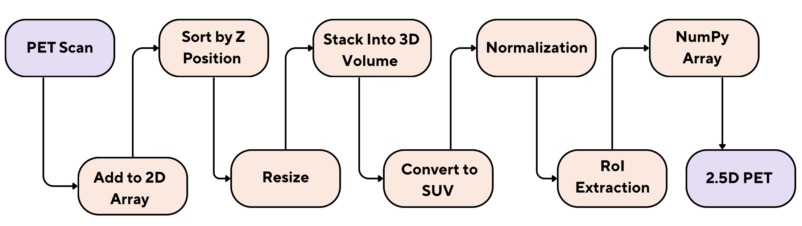

# Generative Augmentation of Anatomical-Functional Imaging for Rare Lung Cancer Subtype Classification

## Overview
This repository contains data pipelines, preprocessing pipelines, and experimental notebooks for applying generative augmentation techniques for rare lung cancer subtype classification using anatomical (CT) and functional (PET) imaging data.

## Experiment Desgin
The project consists of (1) preprocessing PET DICOM series into consistent 2.5D lung-focused NumPy volumes, (2) training generative models to synthesize additional PET samples. The below figure outlines the complete experiment design.


*Figure: Experiment Design*

### Notes on Labels and Splits
- The raw and preprocessed datasets are commonly organised by class folders (e.g., `A/`, `B/`, `G/`).
- When reproducing results, ensure the same random seed (42) is used.


### Requirements
- Python 3.9+ is recommended.


## Preprocessing (DICOM → 2.5D Lung Regions)
The preprocessing scripts in `preprocessing/` convert DICOM series into resized, intensity-processed, and trimmed 2.5D volumes saved as `.npy` files.

### PET Preprocessing Pipeline
The PET pipeline sorts slices by Z position, stacks them into a 3D volume, converts intensities to Standardized Uptake Value (SUV), normalizes, extracts a lung-focused region-of-interest (RoI), and outputs a 2.5D representation saved as a NumPy array.



*Figure: PET preprocessing pipeline*

Data path configuration:
- `data/Datasets/Lung-PET-CT-dx` (The Lung-PET-CT-Dx dataset can be obtained from The Cancer Imaging Archive.)

Dataset preparation and inspection:
- `data/Pipelines/Lung-PET-CT-Dx.ipynb` (dataset preparation and inspection)

Typical entry point:
- `experiment/pet_preprocessing.py` for PET volumes.

These scripts assume the repository is executed from the project root and expect input data under:
- `data/raw/PET/<CLASS>/<PATIENT>/.../*.dcm`

Outputs are written under `data/preprocessed/` with threshold-specific subfolders.

## Experiments
Most modelling and analysis is captured in Jupyter notebooks under:
- `notebooks/` (diffusion models, checkpoints, evaluation, and visualisations)

## Reproducibility and Compute
- Deep learning components (e.g., diffusion models and UNet backbones) typically require a 80 GB VRAM for practical runtimes.
- Some notebooks were authored for hosted notebook environments (e.g., Google Colab Pro) and may contain environment-specific imports or filesystem paths. Adapt paths and runtime settings as needed for local execution.

## Complete Experiment

The complete experiment is available at:
- https://github.com/RumethSandinu/NeoBreath.git


## Citation

If you use this work, please cite:

```bibtex
@inproceedings{payagalage2026generative,
  author    = {Rumeth Payagalage and Prasan Yapa},
  title     = {Generative Augmentation of Anatomical-Functional Imaging for Rare Lung Cancer Subtype Classification},
  booktitle = {Proceedings of the 19th International Joint Conference on Biomedical Engineering Systems and Technologies - Volume 1: Dual-imaging},
  year      = {2026},
  pages     = {719--724},
  publisher = {SciTePress},
  doi       = {10.5220/0014707100004070}
}
```